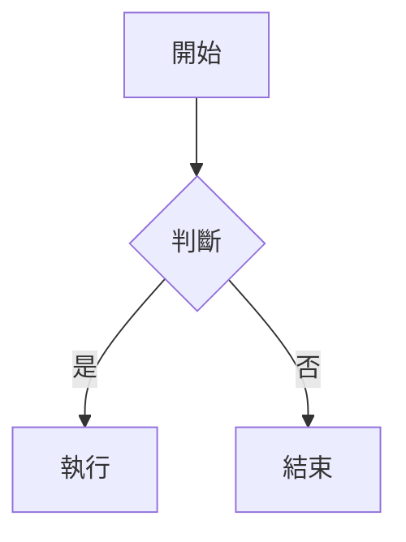

# Markdown & Mermaid 線上渲染器

一個簡潔的 Web 應用程式，讓使用者可以即時預覽 Markdown 內容，並支援 Mermaid 圖表渲染。

## 🎯 專案目標

- 提供一個簡單易用的網頁介面
- 讓使用者可以貼上或輸入 Markdown 文字
- 即時渲染 Markdown 內容為格式化的 HTML
- 支援 Mermaid 圖表語法，將其渲染為視覺化圖表

## ✨ 功能特點

### 核心功能
- **Markdown 渲染**：支援標準 Markdown 語法（標題、列表、連結、程式碼區塊等）
- **Mermaid 圖表**：支援所有 Mermaid 圖表類型（流程圖、時序圖、甘特圖等）
- **即時預覽**：輸入內容後即時顯示渲染結果（500ms 防抖優化）
- **程式碼語法高亮**：Markdown 中的程式碼區塊具有語法著色，支援多種程式語言
- **PDF 下載**：一鍵將渲染結果匯出為 PDF 文件，支援 Mermaid 圖表

### 使用者體驗
- **深色/淺色主題**：可切換顯示主題，自動同步編輯區與預覽區
- **字體大小調整**：可調整編輯區與預覽區的字體大小（10-24px）
- **預設範例內容**：新頁籤自動帶入 Markdown + Mermaid 範例，方便快速上手
- **確認刪除對話框**：刪除頁籤前會彈出確認，避免誤刪
- **RWD 響應式設計**：適配手機與平板裝置，小螢幕自動切換為上下佈局

## 🖥️ UI 設計

### 整體佈局
- **左右分割面板**：畫面分成左右兩個部分
  - 左邊：原始 Markdown 編輯區
  - 右邊：渲染後的預覽結果
- **可調整分隔線**：中間的分界線可以手動拖曳調整大小
- **預設比例**：左邊（編輯區）預設為 35%，可調整範圍 20%-80%

### 多頁籤系統
- 使用者可以建立多個頁籤，同時管理多個不同的文件
- 每個頁籤代表一個獨立的文件
- 支援新增/刪除頁籤
- 頁籤之間可自由切換
- 雙擊頁籤名稱可進入編輯模式

### 本地儲存
- 每個分頁的 Markdown 內容都會自動儲存至瀏覽器的 localStorage
- 重新開啟頁面時會自動恢復上次的內容與頁籤狀態
- 包含頁籤列表、活動頁籤、字體大小等設定

## 🚀 使用方式

### 安裝與執行

#### 前置需求
- Node.js 18+ 
- npm 或 yarn

#### 安裝依賴
```bash
npm install
```

#### 開發模式
```bash
npm run dev
```
開啟瀏覽器訪問 `http://localhost:5173`

#### 建置生產版本
```bash
npm run build
```
建置後的檔案會輸出至 `dist/` 目錄

#### 預覽生產版本
```bash
npm run preview
```

### 基本操作

1. **編輯 Markdown**
   - 在左側編輯區輸入或貼上 Markdown 文字
   - 右側會即時顯示渲染結果

2. **新增頁籤**
   - 點擊頁籤列右側的「+」按鈕
   - 新頁籤會自動帶入範例內容

3. **切換頁籤**
   - 點擊頁籤名稱即可切換

4. **編輯頁籤名稱**
   - 雙擊頁籤名稱進入編輯模式
   - 輸入新名稱後按 Enter 確認，按 Esc 取消

5. **刪除頁籤**
   - 點擊頁籤右側的「×」按鈕
   - 確認對話框後刪除
   - 如果刪除最後一個頁籤，會自動創建新頁籤

6. **調整分割面板**
   - 拖曳中間的分隔線調整左右比例

7. **切換主題**
   - 點擊右上角的設定按鈕
   - 選擇「深色主題」或「淺色主題」

8. **調整字體大小**
   - 點擊右上角的設定按鈕
   - 使用滑桿調整字體大小（10-24px）

9. **下載 PDF**
   - 點擊右上角的 PDF 圖示按鈕
   - 系統會自動將目前的預覽內容轉換為 PDF 並下載
   - 檔案名稱會使用目前頁籤的名稱

### Markdown 語法支援

本應用支援標準 Markdown 語法：

- **標題**：`# H1`、`## H2`、`### H3` 等
- **文字格式**：`**粗體**`、`*斜體*`、`~~刪除線~~`、`` `行內程式碼` ``
- **列表**：無序列表 `-` 和有序列表 `1.`
- **連結**：`[文字](URL)`
- **程式碼區塊**：使用三個反引號包裹，支援語法高亮
- **引用**：`> 引用文字`
- **分隔線**：`---`

### Mermaid 圖表語法

在 Markdown 中使用三個反引號包裹 `mermaid` 程式碼區塊：

````markdown

````

支援的 Mermaid 圖表類型：
- Flowchart（流程圖）
- Sequence Diagram（時序圖）
- Gantt Chart（甘特圖）
- Class Diagram（類別圖）
- State Diagram（狀態圖）
- 以及其他 Mermaid 支援的圖表類型

## 🛠️ 技術堆疊

- **建置工具**：Vite 5.x
- **前端框架**：Vue 3.4+ (Composition API)
- **UI 框架**：Vuetify 3.5+ (Material Design 3)
- **狀態管理**：Pinia 2.1+
- **Markdown 解析**：marked.js 11.x
- **程式碼語法高亮**：highlight.js 11.x
- **圖表渲染**：Mermaid.js 10.x
- **語言**：TypeScript 5.3+
- **樣式**：SCSS

## 📁 專案結構

```
/workspace/
├── index.html              # HTML 入口
├── package.json            # 專案配置與依賴
├── vite.config.ts          # Vite 配置
├── tsconfig.json           # TypeScript 配置
├── src/
│   ├── main.ts             # 應用程式入口
│   ├── App.vue             # 根組件
│   ├── components/         # Vue 組件
│   │   ├── SplitPane.vue   # 可拖曳分割面板
│   │   ├── TabBar.vue      # 頁籤列
│   │   ├── TabItem.vue     # 單一頁籤項目
│   │   ├── MarkdownEditor.vue    # Markdown 編輯區
│   │   ├── MarkdownPreview.vue   # 渲染預覽區
│   │   ├── ConfirmDialog.vue     # 確認刪除對話框
│   │   └── SettingsMenu.vue       # 設定選單
│   ├── stores/
│   │   └── tabsStore.ts    # 頁籤狀態管理 (Pinia)
│   ├── composables/        # 組合式函數
│   │   ├── useMarkdown.ts  # Markdown 渲染邏輯
│   │   ├── useMermaid.ts   # Mermaid 渲染邏輯
│   │   └── useLocalStorage.ts  # 本地儲存邏輯
│   ├── utils/              # 工具函數
│   │   ├── debounce.ts     # 防抖工具
│   │   └── defaultContent.ts  # 預設範例內容
│   ├── styles/             # 樣式檔案
│   │   ├── main.scss       # 全域樣式
│   │   ├── preview.scss    # 預覽區樣式
│   │   └── variables.scss  # SCSS 變數
│   └── types/
│       └── index.ts        # TypeScript 型別定義
└── public/
    └── favicon.ico         # 網站圖示
```

## 🌐 瀏覽器支援

本應用支援以下現代瀏覽器：

- Chrome/Edge 90+
- Firefox 88+
- Safari 14+
- Opera 76+

**注意**：需要支援 ES2020+ 和 Web Storage API。

## 📝 授權

MIT License
